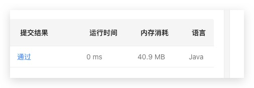

# 11月刷题记录

## 11.18 周三 
### 加油站
暴力法
## 11.19 周四 
### 移动零
因为要求是原地操作，所以不能创建辅助数组。
但是可以利用两个指针来模拟新数组的建立。
第二个指针`j`表示新数组的索引。`O(n)`下就可以完成新数组的建立。最后再在数组后面补零即可。
## 11.20 周五 
### 147.对链表进行插入排序
思路就是常规思路，对单链表进行插入排序。主要优化了一个点：当前节点的值大于前序节点的值时，直接跳过此次排序。运行时间提高了`20ms`
## 11.21 周六  
### 148.排序链表 
今天效率低的要命，昨天做了用插入排序排序链表，今天换了个选择排序，结果超时了。。而且`O(nlogn)`的排序算法只想到快速排序，把归并给忘了，草。
## 11.22 周日  
### 242.有效的字母异位词 
永远是力扣底层人。。

思路有两种
1. 排序
2. 哈希表

我是用的哈希表做的，排序没有想到，就是把两个字符串排序看它们是否相等即可。另外用的哈希表还真实诚地用了`Hashmap`，题目已知26个字母了，所以长度是26，可以用数组来构建哈希表，进行进一步优化。
1. `Hashmap`中有`getOrDefault(key, defaultValue)`，可以省掉自己的`if`判断的操作。
2. 数组初始化时，默认值是0

### 3.无重复字符的最长子串
`debug`了三次，推到了第一次的想法重来的，又一次`leetcode`人下人

一开始是想用哈希表来判断字符有没有重复，但是有个问题，哈希表没法判断已存的子串的顺序，所以也没办法记忆重复字符后面的字符，只能全部消除。

后来又想可不可以用一个变量维护一个最长子串，所有操作对这个变量进行，长度也好维护。

我发现目前我总是习惯用代码去描述/表达算法的过程，虽然通常可以实现，但是却不是最优解。

比如此题，我想去维护一个最长子串，就真的用`StringBuilder`去维护整个子串了，而答案中仅用左右两个指针就表示了。

## 11.24 周二
### 222.完全二叉树的结点数
> 周一下午到晚上都在外面干活。。回来就懒得打卡了

今天的题蛮常规的，遍历就可以了。

## 11.25 周三

### 1370.上升下降字符串
> BBTime: 每次这种题都会想办法用代码去模拟算法，尽可能具体的把每一步写出来，但是要不写不出来，要不写出的代码鲁棒性很差。
比如今天这道题，想办法模拟，但是又囿于各种条件牵扯。
然而一般答案都不会直接去模拟算法，都是用巧劲，尽可能得抽象，而不是具体。

**桶计数**
1. 字符只有26个小写字母 
2. 数组当做哈希表，`key`值是`ch-'a'`，这样就可以把26个字母和数组的26个索引一一对应

**ch-'a'**是映射函数

 感觉这题就是为了这种思路而出的，不是说这个思路解决了这个问题。正向遍历一遍数组，在逆向遍历一遍数组。
 
 
## 11.26 周四
### 164.最大间距
要求排序时间、空间复杂度为`O(N)` -》基数排序/桶排序（220题）

#### 基于桶的算法
> 前提相邻数字的最大间距不会小于`(max-min)/(N-1)`

确定桶的长度`d=(max-min)/(N-1)`，所有如果两个元素落在同一个桶里，则他们的间距肯定不是最大的。最大相邻间距是相邻两个桶的`max-min`

## 11.27 周五
### 454.四数相加II
求两数之和的进阶版。

TODO 待整理

## 11.28 周六
### 220.存在重复元素III
两个指针满足条件`i-j <= k`，即维护一个大小为`k`的滑动窗口。

在每一个滑动窗口内，使用**桶排序**，桶的大小为`t+1`，桶的区间在`..., [0, t], [t+1, 2t+1], ...`中。

在每一轮遍历中，使用**映射函数**把当前元素映射到一个桶中
1. 如果当前桶中有元素，则这两个元素的差值一定小于等于`t`；
2. 如果前一个桶中有元素，则判断其和当前元素的差值是否小于等于`t`；
3. 如果后一个桶中有元素，则判断其和当前元素的差值是否小于等于`t`；
4. else 将其放入桶中

每轮结束后，维护滑动窗口

P.S. 桶可以用哈希表表示，注意映射函数、桶的区间

### 493.翻转对
> BBTime：一开始确实想到了有点像求数组的逆序数，但是又没有继续考虑下去，直接去暴力解了，草。结果就是改了一下比较条件就不会了。大约一个月前还写了求逆序数的算法，就是利用归并排序。
又在不知道在哪里添加判断条件卡了很久，其实说白了还是对归并排序不熟悉。因为逆序数正好可以利用比较`a[i]>a[j]`就能得出，而换了条件之后不知道在哪添加判断条件累加逆序数了。

无论逆序数也好，还是翻转对也好，利用的都是归并排序的性质，将两个有序数组`nums1,nums2`归并。当`nums[i]>nums[j]`时或者`nums[i]>2*nums[j]`时，
那么`nums[i]`之后的所有元素都满足前面的条件，所以`inversions += mid - i + 1`。

在合并之前统计一下逆序数就好了。

另外用归并排序写完后还TM超时，对比了答案，发现自己的辅助数组每次`merge`都要把数组的所有值都复制一遍，ORZ。 
## 11.29 周日
### 976.三角形的最大周长
> BBTime: 本来只是想随便试试，骗骗测试用例，没想到还过了，担心写的程序没考虑到一下情况：`a<b<c<d`时，选择`a,c,d`作为三边。但如果`b,c,d`不能组成三角形的话，`a,c,d`也一定组不成三角形。

1. 判断三角形的充要条件：任意两边之和大于第三边。
2. 最优解不可能是排序后的非相邻元素，只能是相邻元素。 
3. 判断是否是三角形时，只要判断两个短边之和大于长边即可。

 
 
## 11.30 周一
### 767.重构字符串
> BBT：自己想思路，然后验证，再debug通过的感觉爽啊

思路：
1. 字符串只包括小写字母-->可以用哈希表记录字符出现的数量
2. 重构时，每次遍历哈希表都把个数大于零的元素放到结果数组中
3. 如果当前元素和结果数组的尾元素重复，则向前找一个合适的位置插进去，找不到合适的返回""

题解的思路：

1. 将出现次数最多的字符放到偶数索引上
2. 将剩下的字符先把偶数索引放满
3. 放满偶数位置，再把剩下的元素放满奇数的位置 
