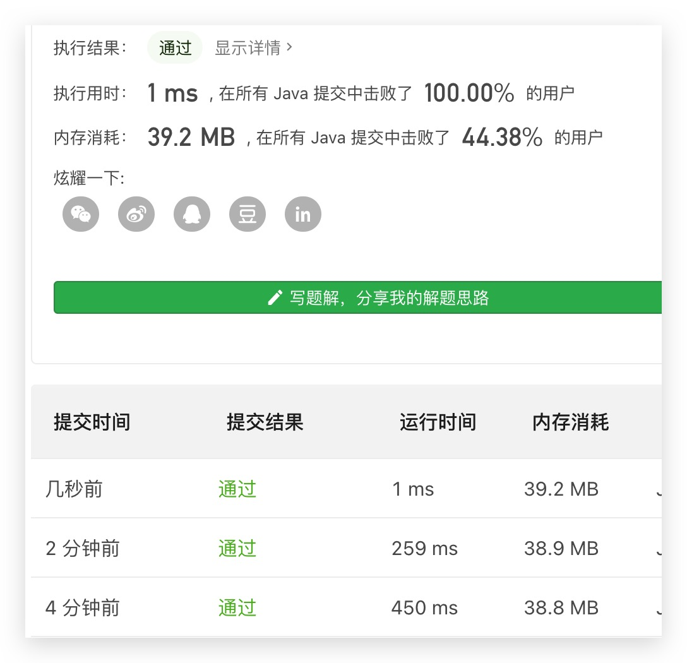

# 1月刷题记录
## 1.1 周五
### 51.数组中的逆序数
> BBTime：知道利用归并排序，可是超时了。。而且归并排序又一次没写出来，我是猪

超时在复制了整个数组到辅助数组上。不应该这么复制的，只需要复制lo到hi之间的元素即可。

### 605.种花问题
> BBTime：写代码就跟打补丁一样。写出通用的代码真难。


### 52.两个链表的第一个公共节点
1. 用栈存节点，出栈比较是否相等。
2. 计算两个链表长度，操作指针使他们长度对齐，然后同时向后移动，判断节点是否相等。

### 53-1 在排序数组中查找数字
1. 用二分查找找到元素，再向左向右找个数

## 1.2 周六 
### 54.求二叉树的深度/55.判断平衡二叉树
54.递归求深度

55.求左子树、右子树深度，判断差值是否大于1？false:true

## 1.3 周日
### 56-I 数组中数字出现的次数
直接看的答案。感觉题目就是面向答案出的，考察异或的性质？

1. 异或数组中所有数字，由于有两个不同的只出现一次的数字，结果可定不为0
2. 找到结果中一位是1的位置记为index
3. 将数组分为两个子数组a和b，a中所有数字在index位上值为1，b中所有数字在index位上值为0
4. 异或a数组所有数字，得到一个值；异或b数组所有数字，得到一个值

### 56-II 数组中只出现一次的数（其他数出现3次）
考察位运算。将数组中所有数的所有位相加，如果位数上的数%3==0，说明目标数在该位数上是0，否则是1

### 57. 和为s的两个数字
1. 用哈希表存
2. 维护两个指针，一个从前往后，一个从后往前，判断两个指针指向的值相加是否等于`target`，充分利用有序递增的特性

### 57-II 和为s的连续正数序列
答案思路和上一题类似，还是使用两个指针维护起点和中点。

### 58-II 左旋转字符串
旋转两次

## 1.4 周一
### 59-I.滑动窗口的最大值
想到的办法只超过5%的人。。用的是最大堆（优先队列）。

答案是用双向队列维护滑动窗口的最大值。队列中只存放可能成为最大值的数，而不是所有数。

每次移动窗口后，如果最大值等于移出窗口的那个值，则删掉队列中的最大值（即最左边的数）。如果加入队列的数，大于队列中的部分数，则删掉部分数，若小于，则直接加入。

## 1.5 周二
### 59-II 队列的最大值
思路与上一题一致，用双端队列维护最大值。存入值时，也要存入一个当前索引，用来判断出列时是否是最大值出列。

## 1.13 周三
### 62. 圆圈中最后剩下的数字
约瑟夫环吗？用列表模拟环，跑到26/36超时了。

既然是环，就应该要想到模运算。

好奇怪，为什么用`LinkedList`会超时，而`ArrayList`不会超时？后者的实现不是基于数组的吗，前者不是删除节点的效率比后者高吗？

### 63.股票的最大利润
1. 直接`O(N^2)`暴力找最大利润。
2. 贪心：维护当前天数及其之前的最低买入点的价格，然后只计算当前卖出的价格-最低价格，如果大于最大值，则更新最大值

### 64. 求1+2+...+n的和
？？？直接递归就可以了吗？

好吧，没看到不让用if语句，可以利用逻辑运算符的**短路**性质
```
// 如果n > 0则继续执行逻辑与运算符后面的语句
// 如果n == 0 则结束递归
bool flag = n > 0 && (n += sum(n-1)) > 0;
```


### 68-I.二叉搜索树的最近公共祖先
自己想到的办法：

把两个节点的祖先用队列存起来。然后队列同时出列，当遇到出列元素不相等或者出列元素为空时，前一个出列元素为最近公共祖先

答案：分析q/p节点和root节点的关系，一共有三种：
1. p、q分别在root的左边和右边
2. p、q都在root的左边 （p.val < root.val && q.val < root.val)
3. p、q都在root的右边 (p.val > root.val && q.val > root.val)

## 1.16 周六
### 68-II.二叉树的最近公共祖先
> 虽然又是底层人，但能跑出来还是挺开心的


思路是先分别求出根结点到两个节点的路径，然后类似求两个链表的公共节点那种思路。

答案看不懂，放弃。

### 65.不用加减乘除做加法
用位运算处理加法和进位
```
int add(int a, int b) {
    int sum, carry;
    do{
        sum = a^b; //加法不考虑进位
        carry = (a&b) << 1;//进位
        a = sum;
        b = carry;
    } while(b != 0);
    return a;
}
```


### 66.
日常暴力超时`O(n^2)`

更高效的算法就是利用已求得的数据来计算下一个数据，就不需要从头到尾再乘一遍。

## 1.25 周一
### 959.由斜杠划分区域
学习了一个新的数据结构：**并查集**，他维护了一个存放父节点索引的数组。同时提供两个方法：
1. `Find(q)`：找到q元素所在的集合
2. `Union(q,p)`：将元素p和q连接起来

## 1.26 周二
### 1128.等价多米诺骨牌的数量
第一次用`O(n^2)`的思路暴力找等价的数量果然超时了。

第二次先把每行和相同的行索引存起来，然后再比较他们的列是否满足等价条件。用空间换时间。

看了答案后，发现可以更简单的利用哈希表。将`(x, y)`固定为一个二位数，较小的放到十位上，这样就可以将二位数固定在99以内。

## 1.28 周四
### 724.寻找数组的中心索引


一步步优化调通的感觉爽的飞起啊（虽然是道简单题。。）